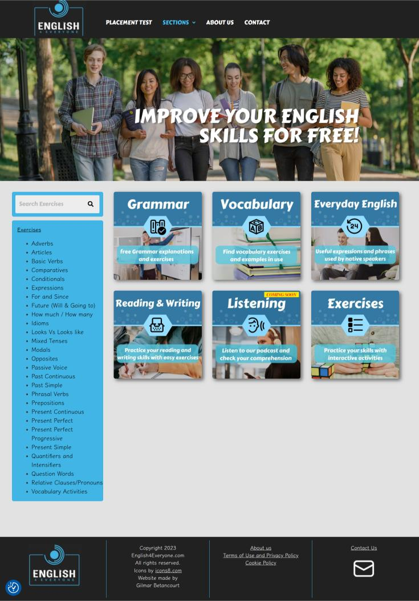
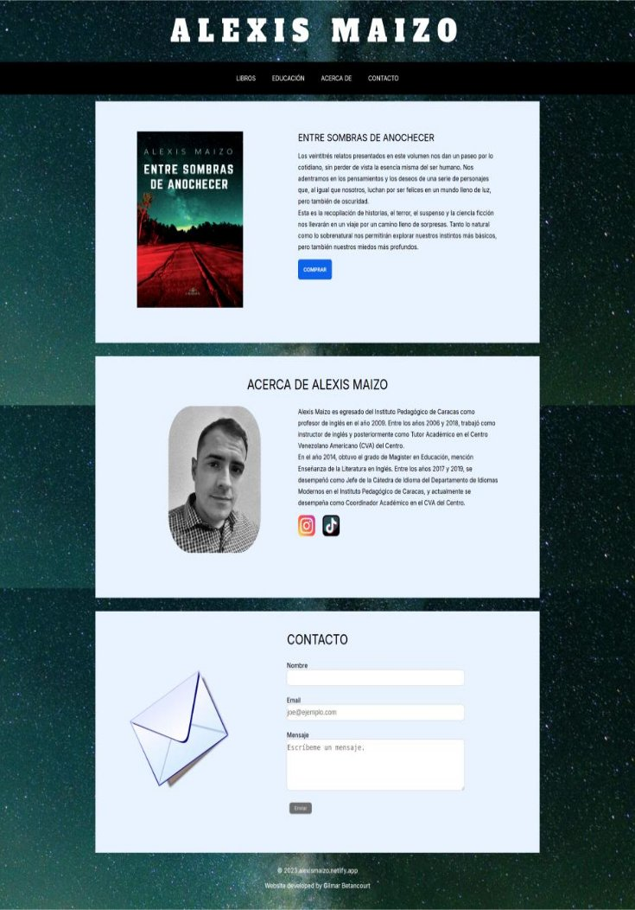

## Hi there 👋 
I'm a fullstack developer who loves working with simple JS, HTML, and CSS. But I also work with other technologies:

    
    
    
    
    
    
    

 
Some of my work looks like this:
 

    
    

 
Drop me a line at gabetach@gmail.com.